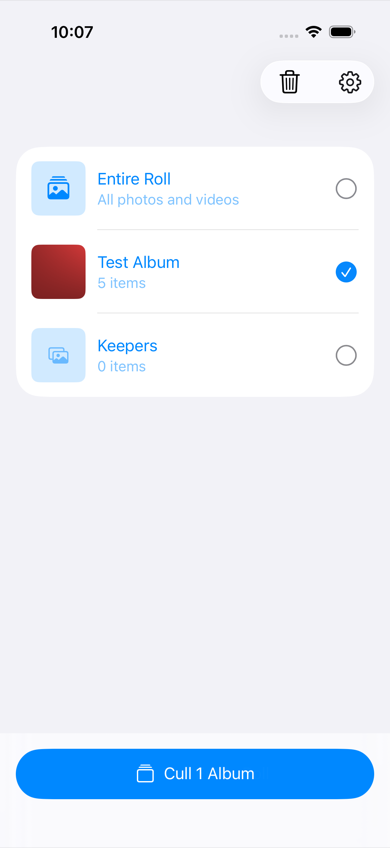
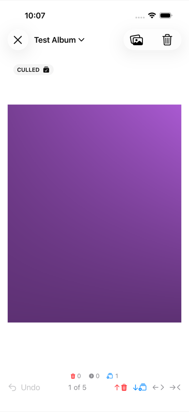
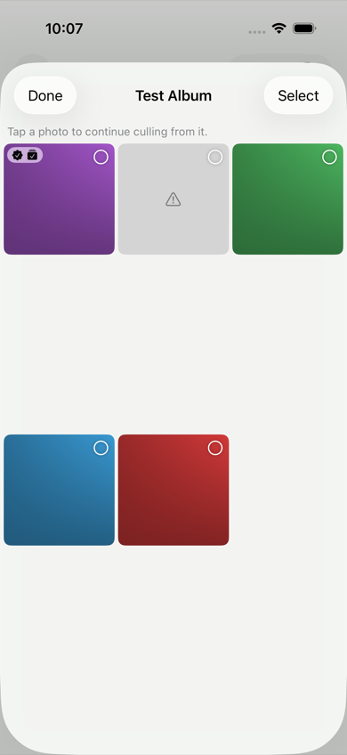

# immich-cull

A native iOS app for quickly culling photos and videos on a self-hosted [Immich](https://immich.app) server. Swipe through your library one image at a time and bin, favourite, or file each shot into an album — without waiting on a web UI.

> **Disclaimer:** immich-cull is an unofficial, independent project. It is **not affiliated with, endorsed by, or sponsored by** the Immich project or its maintainers. "Immich" is the property of its respective owners.

| Pick what to cull | Swipe through it | Jump around the queue |
|---|---|---|
|  |  |  |

<sub>Screenshots are captured against the project's mock server, so the "photos" are generated gradients rather than anyone's library. Regenerate them with `scripts/capture-screenshots.sh`.</sub>

## Features

- **Swipe to cull.** An interactive horizontal pager (like the Photos app): the neighbouring images track your finger and slide into place, with a red marker only when a swipe would bin the photo. Each direction is mapped to an action, and every mapping is configurable in Settings:

  | Direction | Default action |
  |---|---|
  | Up | Move to Immich trash |
  | Left | Next image |
  | Down | Add to a chosen album |
  | Right | Previous image |

  Other assignable actions: **Favorite**, **Undo**, and **Do Nothing**.

- **Going back doesn't undo.** Stepping back to the previous image leaves what you did to it alone — favourites stay favourited, filed photos stay filed, and deletions stay deleted. Going back to look at what you did shouldn't quietly reverse it. **Undo** still reverses everything, and the trash bin keeps deleted photos either way.
- **Down-swipe is a toggle.** Swiping onto a photo that's already in your album takes it back out; the same goes for favourites. So the way to change your mind is to swipe again, on the photo itself.
- **You can see what you've already done.** Photos carry badges for culled, favourited, and filed-in-album — on the card and on the grid thumbnails — so you're never guessing whether a swipe landed.
- **Reviewed photos stay reviewed.** Moving past an asset tags it in Immich (default tag: `culled`) so it isn't offered again on the next run. Pick which of your server's tags count as "already culled" (any number of them) and which single tag the app writes; a toggle re-offers already-reviewed assets.
- **Pick your scope.** Cull the entire roll (default), one album (which pins itself to the top of the list), or the **Not in Any Album** pile — everything you haven't sorted yet. Albums are ordered by date, following the same newest/oldest setting the deck uses. Pull to refresh.
- **Browse and bulk-trash.** Open any album, the whole roll, or the unsorted pile as a full-screen grid; drag-select across it and move the lot to the Immich trash in one step, or tap a single photo to start swiping from there.
- **Photos, videos, or both** — switchable from the cull screen itself, not just before you start, because that's usually when you realise.
- **Videos included.** Video assets play muted inline while you review them, letterboxed onto the same background as photos rather than sitting in a black box.
- **Undo anything.** Every action is reversible — undo restores from the trash, removes from the album, or clears the tag, on the server.
- **Trash bin.** A red badge counts what's in the Immich trash, on the main screen and on the cull screen, where it updates the moment you swipe. Open it to review, restore, or permanently delete — or **Empty Trash** to clear the lot in one step. Emptying clears the badge and drops those items from the undo history, since they can no longer be restored.
- **Select by dragging.** In any thumbnail grid, press and hold a photo and then slide your finger, like the Photos app: everything between where you started and where your finger is gets selected, so dragging onto the next row takes the rest of the row with it. Drag back to release. Start on a photo that's already selected and the same drag deselects instead. Hold your finger near the top or bottom edge and the grid scrolls under it, carrying the selection on past a screenful.
- **Local cleanup.** Optionally remove the matching photo/video from the iPhone's own library when you trash it (matched by filename and capture date, deleted in one batch at the end of a session). Permanent deletes from the trash bin always remove local copies too.
- **Stats.** Lifetime counters for deleted / reviewed / filed / favourited, plus the current server trash size, all in Settings.
- **Appearance.** System (default), Light, or Dark — photos sit on a matching background rather than in a black box.

## Requirements

- iOS 17 or later
- A reachable Immich server and an API key

## Getting started

1. Launch the app. It scans your local network for an Immich server on port 2283 — tap a result, or enter the server URL manually.
2. Paste an API key (Immich web UI → **Account Settings → API Keys**).
3. Choose what to cull and start swiping.

Credentials are stored in the iOS Keychain; the rest of the settings live in `UserDefaults`.

## Building from source

The Xcode project is generated by [XcodeGen](https://github.com/yonyz/XcodeGen) from `project.yml` — don't edit `ImmichCull.xcodeproj` by hand.

```bash
brew install xcodegen
xcodegen generate
xcodebuild -project ImmichCull.xcodeproj -scheme ImmichCull \
  -destination 'platform=iOS Simulator,name=iPhone 17' build
```

To put it on a device, `./build-ipa.sh` produces a signed `build/ImmichCull.ipa` (override the signing team with `TEAM_ID=…`):

```bash
./build-ipa.sh
xcrun devicectl device install app --device <UDID> build/ImmichCull.ipa
```

## Privacy

immich-cull talks only to the Immich server you point it at. There is no analytics, no telemetry, and no third-party dependencies. Photo library access is requested only if you enable deleting local copies.

## License

Copyright (C) 2026 Miklos Szel

immich-cull is free software: you can redistribute it and/or modify it under the terms of the **GNU General Public License, version 3** as published by the Free Software Foundation.

This program is distributed in the hope that it will be useful, but WITHOUT ANY WARRANTY; without even the implied warranty of MERCHANTABILITY or FITNESS FOR A PARTICULAR PURPOSE. See the [GNU General Public License](LICENSE) for more details.
